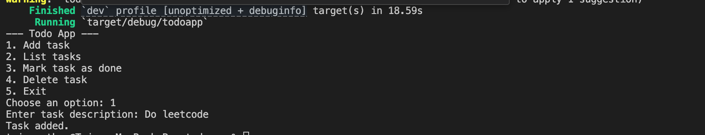

# Rust CLI Todo App

A simple command-line todo list manager built in Rust.  
Supports adding, listing, marking as done, and deleting tasks — all stored in a local JSON file.

## Features

- Add new tasks  
- List all tasks  
- Mark tasks as done  
- Delete tasks  
- Persistent storage using `tasks.json`

---

## Installation

1. Clone the repository:

   ```bash
   git clone https://github.com/pengu2004/Todolo.git
   cd Todolo
---

## Installation

1. Clone the repository:

   ```bash
   git clone https://github.com/pengu2004/Todolo.git
   cd todoapp
2.	Add dependencies in Cargo.toml:
   
   ```bash
   [dependencies]
    serde = { version = "1.0", features = ["derive"] }
    serde_json = "1.0"

3. Build the project:
  ```bash
   cargo build
4. Run the project:
   ```bash
   cargo run

## Screenshot

Here’s a sample interaction with the Todo App:

